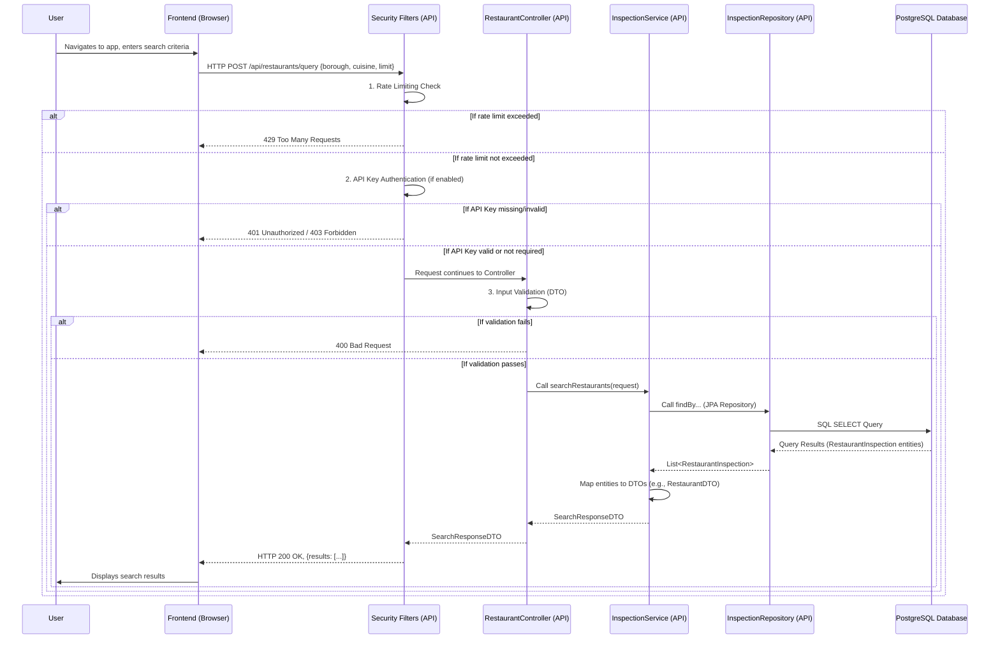

<!--
  Generated by AI-Powered README Generator
  Repository: https://github.com/GDSC-FSC/gdg-fsc-x-bc-cloud-workshop
  Generated: 2025-10-09T19:13:32.305Z
  Format: md
  Style: comprehensive
-->

# 🍕 NYC Restaurant Safety Finder

[](https://github.com/GDSC-FSC/gdg-fsc-x-bc-cloud-workshop/actions)
[](https://github.com/GDSC-FSC/gdg-fsc-x-bc-cloud-workshop/blob/main/LICENSE)
[](https://www.oracle.com/java/technologies/downloads/)
[](https://spring.io/projects/spring-boot)
[](https://react.dev/)
[](https://www.postgresql.org/)

**A robust, full-stack cloud application for securely querying NYC restaurant health inspection data.**

---

## 🧭 Table of Contents

- [Overview / Introduction](#-overview--introduction)
  - [Purpose & Goals](#purpose--goals)
  - [Why it Matters & Problem Solved](#why-it-matters--problem-solved)
  - [Target Audience](#target-audience)
- [Feature Highlights](#-feature-highlights)
  - [🚀 Core Application Features](#-core-application-features)
  - [🔒 API & Security Features](#-api--security-features)
  - [📦 Database Features](#-database-features)
  - [🌐 Frontend / UI Features](#-frontend--ui-features)
- [Architecture & Design](#-architecture--design)
  - [High-Level Component Diagram](#high-level-component-diagram)
  - [Key Components & Responsibilities](#key-components--responsibilities)
  - [Technology Stack Breakdown](#technology-stack-breakdown)
  - [Detailed API Request Flow](#detailed-api-request-flow)
- [Getting Started / Installation](#-getting-started--installation)
  - [Prerequisites](#prerequisites)
  - [Quick Start with Docker Compose (Recommended)](#quick-start-with-docker-compose-recommended)
  - [Manual Setup](#manual-setup)
    - [1. Database Setup](#1-database-setup)
    - [2. API Backend Setup](#2-api-backend-setup)
    - [3. Frontend Setup](#3-frontend-setup)
- [Usage / Workflows](#-usage--workflows)
  - [Using the Web Application](#using-the-web-application)
  - [Interacting with the API](#interacting-with-the-api)
  - [Utility Scripts](#utility-scripts)
  - [Environment Configuration](#environment-configuration)
- [Limitations, Known Issues & Future Roadmap](#-limitations-known-issues--future-roadmap)
  - [Current Limitations](#current-limitations)
  - [Known Issues](#known-issues)
  - [Future Roadmap](#future-roadmap)
  - [Request a Feature](#request-a-feature)
- [Contributing & Development Guidelines](#-contributing--development-guidelines)
  - [How to Contribute](#how-to-contribute)
  - [Branching & Pull Request Guidelines](#branching--pull-request-guidelines)
  - [Code Style, Testing & Linting](#code-style-testing--linting)
  - [Development Setup](#development-setup)
- [License, Credits & Contact](#-license-credits--contact)
  - [License](#license)
  - [Credits & Acknowledgments](#credits--acknowledgments)
  - [Contact](#contact)
- [Appendix](#-appendix)
  - [Changelog](#changelog)
  - [FAQ (Frequently Asked Questions)](#faq-frequently-asked-questions)
  - [Troubleshooting Guide](#troubleshooting-guide)
  - [API Reference](#api-reference)

---

## 📖 Overview / Introduction

The **NYC Restaurant Safety Finder** is a robust, full-stack web application designed to empower users with easy and secure access to publicly available NYC health inspection data. This project serves as a comprehensive example of modern cloud-native application development, integrating a secure Spring Boot REST API, a resilient PostgreSQL database, and an intuitive React frontend.

It processes over 200,000 inspection records from NYC Open Data, offering a powerful platform for data exploration and analysis with an emphasis on enterprise-grade security and developer-friendly architecture.

<p align="right"><a href="#-table-of-contents">Back to top ⬆️</a></p>

### Purpose & Goals

The primary goals of this application are:
*   🔍 **Search & Filter**: Provide an intuitive interface to search for restaurants by various criteria such as borough, cuisine, and health grade.
*   📊 **Data Insights**: Enable users to access detailed inspection histories, identify violations, and understand safety trends.
*   🛡️ **Secure Access**: Implement and demonstrate production-ready security features to protect both the application and its users.
*   🎓 **Learning Resource**: Serve as a practical showcase for cloud-native best practices, including microservices architecture, Dockerization, robust API design, and modern frontend development.
*   🚀 **Scalability & Performance**: Design for efficient data handling and quick response times, even with large datasets.

<p align="right"><a href="#-table-of-contents">Back to top ⬆️</a></p>

### Why it Matters & Problem Solved

Navigating the vast and often complex public datasets can be challenging. The NYC Restaurant Safety Finder addresses this by:
*   **Democratizing Data**: Making critical public health data accessible and understandable to the general public.
*   **Enhancing Transparency**: Providing a clear view into restaurant inspection results, fostering public confidence and informed dining choices.
*   **Bridging Technical Gaps**: Offering a pre-built, production-grade example of how to ingest, secure, and present large datasets in a user-friendly manner for developers and organizations.
*   **Ensuring Data Integrity & Security**: Implementing robust validation and security measures to ensure the data presented is accurate and the application is resilient against common web vulnerabilities.

<p align="right"><a href="#-table-of-contents">Back to top ⬆️</a></p>

### Target Audience

This application is built for a diverse audience:
*   **General Public**: Anyone looking for quick and reliable information about restaurant health inspections in NYC before dining out.
*   **Developers**: Those interested in learning about or implementing modern full-stack architectures, Spring Boot API development, React frontend, Docker, and cloud-native patterns.
*   **Data Analysts/Researchers**: Individuals who need to quickly access and filter NYC restaurant inspection data for studies or analysis.
*   **Educational Institutions**: As a practical example for teaching secure, scalable web application development.

<p align="right"><a href="#-table-of-contents">Back to top ⬆️</a></p>

---

## ✨ Feature Highlights

This application is packed with features across its backend, frontend, and infrastructure, all designed for a robust and user-friendly experience.

### 🚀 Core Application Features

*   ✅ **Comprehensive Search**: Effortlessly search for restaurants across NYC.
*   ✅ **Advanced Filtering**: Filter results by borough, cuisine type, and health grade.
*   ✅ **Detailed Inspection History**: Access a full timeline of inspections for any restaurant, including specific violations.
*   ✅ **Data-driven Insights**: Understand health inspection trends and critical flags.

<p align="right"><a href="#-table-of-contents">Back to top ⬆️</a></p>

### 🔒 API & Security Features

The Spring Boot REST API is built with security and performance as top priorities.

*   ✅ **RESTful Endpoints**: Clean, well-defined endpoints for restaurant queries.
*   ✅ **Input Validation & Sanitization**: Robust validation layers to prevent malformed requests and protect against injection attacks.
*   ✅ **Rate Limiting**: Configurable rate limiting (default: 100 requests/minute per IP) to prevent abuse and ensure fair usage.
*   ✅ **SQL Injection Prevention**: Utilizes prepared statements and JPA to mitigate SQL injection risks.
*   ✅ **XSS Protection**: Sanitizes inputs and outputs to prevent Cross-Site Scripting vulnerabilities.
*   ✅ **Security Headers**: Automatically applies essential security headers (CSP, X-Frame-Options, X-Content-Type-Options, Strict-Transport-Security, Referrer-Policy) for enhanced browser security.
*   ✅ **Configurable CORS**: Flexible Cross-Origin Resource Sharing (CORS) configuration for seamless frontend integration.
*   ✅ **Optional API Key Authentication**: Support for API key-based authentication for clients needing secure, programmatic access.
*   ✅ **Comprehensive Error Handling**: Consistent and informative error responses for various API issues.
*   ✅ **Request/Response Logging**: Detailed logging for monitoring, debugging, and auditing.

> [!TIP]
> For a deep dive into API security, refer to the dedicated documentation: [API Security Overview](docs/api/SECURITY.md) and [Security Quick Reference](docs/api/SECURITY_QUICK_REFERENCE.md).

<p align="right"><a href="#-table-of-contents">Back to top ⬆️</a></p>

### 📦 Database Features

The PostgreSQL database is the backbone, storing vast amounts of inspection data.

*   ✅ **Automatic Data Loading**: Seamlessly loads ~200,000+ inspection records from NYC Open Data into PostgreSQL upon setup.
*   ✅ **PostgreSQL Powered**: Leverages the reliability and performance of PostgreSQL.
*   ✅ **Optimized Indexing**: Database schema includes optimized indexes for fast query performance, especially on search and filter criteria.
*   ✅ **Docker-based Deployment**: Easy to set up and manage the database using Docker and Docker Compose.

<p align="right"><a href="#-table-of-contents">Back to top ⬆️</a></p>

### 🌐 Frontend / UI Features

Built with React, Vite, and TailwindCSS, the frontend offers a modern and responsive user experience.

*   ✅ **Interactive Search Interface**: Dynamic search form with live filtering.
*   ✅ **Intuitive Filters**: Easy-to-use dropdowns and inputs for filtering by borough, cuisine, and grade.
*   ✅ **Responsive Design**: Optimized for seamless experience across various devices (desktop, tablet, mobile).
*   ✅ **Real-time API Integration**: Fetches and displays data instantly from the backend API.
*   ✅ **Modern UI Components**: Utilizes a custom component library built with Shadcn-UI principles for a polished look and feel.

<p align="right"><a href="#-table-of-contents">Back to top ⬆️</a></p>

---

## 🏗️ Architecture & Design

The application follows a standard multi-tier architecture, designed for clarity, scalability, and maintainability. It consists of a frontend client, a backend API service, and a persistent data store, orchestrated with Docker Compose for ease of deployment.

### High-Level Component Diagram

This diagram illustrates the main components and their interactions within the NYC Restaurant Safety Finder application.

```mermaid
graph TD
    subgraph Client
        A[User Browser/Mobile] -- HTTP/REST --> B(Frontend: React/Vite)
    end

    subgraph Backend Services
        B -- HTTP/REST --> C(API Service: Spring Boot)
        C -- JDBC/SQL --> D[Database: PostgreSQL]
    end

    subgraph Infrastructure
        D -- Docker Volumes --> E[Persistent Data Storage]
    end

    subgraph Security Layer
        C -- Filters --> F(Authentication/Rate Limiting)
        F -- Input Validation --> G(Data Integrity)
    end

    subgraph Data Flow (Setup)
        H[NYC Open Data] -- Initial Load --> D
        Script[db-seed.sh] -- Data Migration --> D
    end

    A --- "Access UI" --- B
    B --- "Search Requests" --- C
    C --- "Query/Store Data" --- D
    C --- "Enforces Policy" --- F
    F --- "Protects API" --- C
    G --- "Prevents Attacks" --- C

    style B fill:#f9f,stroke:#333,stroke-width:2px
    style C fill:#ccf,stroke:#333,stroke-width:2px
    style D fill:#afa,stroke:#333,stroke-width:2px
```

<p align="right"><a href="#-table-of-contents">Back to top ⬆️</a></p>

### Key Components & Responsibilities

1.  **Frontend (React + Vite)**:
    *   **Responsibility**: User interface, user interaction, displaying data.
    *   **Details**: A single-page application built with React, bundled by Vite for fast development and optimized production builds. It uses TailwindCSS for styling and communicates with the Spring Boot API via RESTful calls.
    *   **Location**: `./frontend/`

2.  **API Service (Spring Boot)**:
    *   **Responsibility**: Business logic, data retrieval, security enforcement, exposing RESTful endpoints.
    *   **Details**: A Java-based REST API built with Spring Boot. It handles all backend operations, including data validation, security (rate limiting, API key auth, CORS), and interaction with the PostgreSQL database.
    *   **Location**: `./api/`

3.  **Database (PostgreSQL)**:
    *   **Responsibility**: Persistent storage for restaurant inspection data.
    *   **Details**: A robust relational database. It stores the imported NYC health inspection records and is accessed by the Spring Boot API. Managed via Docker for isolated environments.
    *   **Location**: Managed via `docker-compose.yml`

4.  **Security Layer**:
    *   **Responsibility**: Protect the API from various threats.
    *   **Details**: Implemented within the Spring Boot API, this layer includes custom filters for rate limiting, API key authentication, security headers, and robust input validation.
    *   **Location**: `./api/src/main/java/com/example/api/web/` and `./api/src/main/java/com/example/api/config/`

5.  **Utility Scripts**:
    *   **Responsibility**: Automate common development and deployment tasks.
    *   **Details**: Bash scripts for database setup, data seeding, project building, cleaning, and starting development servers.
    *   **Location**: `./scripts/`

<p align="right"><a href="#-table-of-contents">Back to top ⬆️</a></p>

### Technology Stack Breakdown

| Component     | Technologies                                                                                             |
| :------------ | :------------------------------------------------------------------------------------------------------- |
| **Backend API** | Java 21, Spring Boot 3.5.x, Gradle, Spring Web, Spring Data JPA, PostgreSQL Driver, Lombok, JWT (for potential future auth) |
| **Frontend**  | React 18, Vite, JavaScript (ESM), TailwindCSS, Axios (HTTP client), Shadcn-UI (principles for components)   |
| **Database**  | PostgreSQL 16                                                                                            |
| **Containerization** | Docker, Docker Compose                                                                                   |
| **Build & Dev Tools** | npm, Gradle, Bash Scripts                                                                                |
| **Documentation** | Markdown                                                                                                 |

<p align="right"><a href="#-table-of-contents">Back to top ⬆️</a></p>

### Detailed API Request Flow

This sequence diagram illustrates a typical user request to search for restaurants, highlighting the path through the security filters to the database.



<p align="right"><a href="#-table-of-contents">Back to top ⬆️</a></p>

---

## 🚀 Getting Started / Installation

This section provides instructions for setting up and running the NYC Restaurant Safety Finder. The recommended approach is using Docker Compose, which simplifies the setup process significantly.

<p align="right"><a href="#-table-of-contents">Back to top ⬆️</a></p>

### Prerequisites

Ensure you have the following installed on your system:

*   **Git**: For cloning the repository.
    *   `git --version` (e.g., `git version 2.34.1`)
*   **Docker & Docker Compose**: Essential for containerized setup.
    *   `docker --version` (e.g., `Docker version 24.0.5`)
    *   `docker compose version` (e.g., `Docker Compose version v2.20.2`)
*   **Java Development Kit (JDK) 21+**: Required for building and running the Spring Boot API manually.
    *   `java -version` (e.g., `openjdk version "21.0.1"`)
*   **Node.js 18+ & npm**: Required for building and running the React frontend manually.
    *   `node -v` (e.g., `v18.18.0`)
    *   `npm -v` (e.g., `10.2.3`)

<p align="right"><a href="#-table-of-contents">Back to top ⬆️</a></p>

### Quick Start with Docker Compose (Recommended)

The easiest way to get the entire application (PostgreSQL, Spring Boot API, and React Frontend) up and running is using Docker Compose.

1.  **Clone the repository:**

    ```bash
    git clone https://github.com/GDSC-FSC/gdg-fsc-x-bc-cloud-workshop.git
    cd gdg-fsc-x-bc-cloud-workshop
    ```

2.  **Build and Start Services:**
    This command will build the Docker images for both the API and frontend, create the PostgreSQL container, set up the database, and seed it with data.

    ```bash
    docker compose up --build -d
    ```

    > [!IMPORTANT]
    > The initial `docker compose up` will trigger the database seeding process, which involves downloading and processing a large dataset (over 200,000 records). This might take several minutes depending on your internet connection and system performance. You can monitor the progress by checking the logs: `docker compose logs -f api`.

3.  **Verify Services:**
    Once all services are up and the database seeding is complete:
    *   **Frontend**: Open your browser to `http://localhost:5173`
    *   **API Health Check**: `curl http://localhost:8080/api/restaurants/health`
        *   Expected output: `{"status":"UP"}`

4.  **Stop Services:**
    To stop and remove all Docker containers, networks, and volumes (database data will be lost unless you explicitly manage volumes):

    ```bash
    docker compose down
    # To also remove anonymous volumes (i.e., database data)
    # docker compose down -v
    ```

<p align="right"><a href="#-table-of-contents">Back to top ⬆️</a></p>

### Manual Setup

If you prefer to run the components independently without Docker Compose, follow these steps.

#### 1. Database Setup

First, set up and seed the PostgreSQL database using the provided script.

```bash
# Navigate to the root of the project
cd gdg-fsc-x-bc-cloud-workshop

# Run the database setup script
# This will:
# - Start a PostgreSQL container via Docker
# - Create a Docker network and volume for persistence
# - Seed the database with NYC restaurant inspection data
./scripts/db-setup.sh
```

> [!NOTE]
> The `db-setup.sh` script handles starting a PostgreSQL Docker container and seeding it. If you have an existing PostgreSQL instance, you'll need to manually create a database named `restaurant_inspections` and then use `scripts/db-seed.sh` (after configuring `application.properties` in `api/` to point to your local DB).

Verify the database container is running:
```bash
docker ps
```
You should see a container named `restaurant-db` or similar.

<p align="right"><a href="#-table-of-contents">Back to top ⬆️</a></p>

#### 2. API Backend Setup

The API is a Spring Boot application.

1.  **Navigate to the API directory:**

    ```bash
    cd api
    ```

2.  **Build the API:**

    ```bash
    ./gradlew clean build
    ```
    This will compile the Java code and package it into a JAR file.

3.  **Run the API:**

    ```bash
    java -jar build/libs/api-0.0.1-SNAPSHOT.jar
    ```
    The API will start on `http://localhost:8080`.

    > [!TIP]
    > You can also run the API directly in development mode with `npm run dev:api` from the project root after `npm install`.

<p align="right"><a href="#-table-of-contents">Back to top ⬆️</a></p>

#### 3. Frontend Setup

The frontend is a React application built with Vite.

1.  **Navigate to the frontend directory:**

    ```bash
    cd frontend
    ```

2.  **Install dependencies:**

    ```bash
    npm install
    ```

3.  **Start the development server:**

    ```bash
    npm run dev
    ```
    The frontend will be available at `http://localhost:5173`.

<p align="right"><a href="#-table-of-contents">Back to top ⬆️</a></p>

---

## 💡 Usage / Workflows

This section guides you through using the application and its underlying components.

<p align="right"><a href="#-table-of-contents">Back to top ⬆️</a></p>

### Using the Web Application

Once the frontend is running (either via Docker Compose or manual setup at `http://localhost:5173`):

1.  **Access the UI**: Open your web browser and navigate to `http://localhost:5173`.
2.  **Search**: Use the search bar to enter a restaurant name or part of it.
3.  **Filter**: Utilize the dropdowns to filter results by:
    *   **Borough**: Select from "Manhattan", "Brooklyn", "Queens", "Bronx", "Staten Island".
    *   **Cuisine**: Choose from a list of popular cuisines (e.g., "Pizza", "Chinese", "American").
    *   **Grade**: Filter by health inspection grades (e.g., "A", "B", "C", "P" - Passed, "Z" - Grade Pending).
4.  **View Details**: Click on a restaurant card to open a modal with detailed inspection history and specific violations.

<p align="right"><a href="#-table-of-contents">Back to top ⬆️</a></p>

### Interacting with the API

The Spring Boot API runs on `http://localhost:8080`. You can test its endpoints using `curl` or any API client.

#### Health Check

```bash
curl http://localhost:8080/api/restaurants/health
# Expected Output: {"status":"UP"}
```

#### Search Restaurants (POST /api/restaurants/query)

This endpoint allows searching and filtering for restaurants.

```bash
# Example: Search for 10 Pizza restaurants in Manhattan
curl -X POST http://localhost:8080/api/restaurants/query \
  -H "Content-Type: application/json" \
  -d '{
        "borough": "MANHATTAN",
        "cuisine": "Pizza",
        "limit": 10,
        "offset": 0
      }'
```

```json
[
  {
    "id": 12345,
    "camis": "40356018",
    "dba": "DOMINO'S PIZZA",
    "borough": "MANHATTAN",
    "building": "136",
    "street": "W 33RD ST",
    "zipcode": "10001",
    "phone": "2125642647",
    "cuisineDescription": "Pizza",
    "inspectionDate": "2019-12-19T00:00:00.000+00:00",
    "action": "Violations were cited in the following area(s).",
    "violationCode": "04A",
    "violationDescription": "Food Protection Certificate not held by supervisor",
    "criticalFlag": "Not Critical",
    "score": "8",
    "grade": "A",
    "gradeDate": "2019-12-19T00:00:00.000+00:00",
    "recordDate": "2020-03-01T06:01:00.000+00:00",
    "inspectionType": "Cycle Inspection / Initial Inspection"
  }
  // ... more results
]
```

#### Get Restaurant Details by CAMIS (GET /api/restaurants/details/{camis})

Retrieve all inspection records for a specific restaurant using its CAMIS (Centralized Application Management Information System) ID.

```bash
# Replace 40356018 with an actual CAMIS from your database
curl http://localhost:8080/api/restaurants/details/40356018
```

```json
{
  "camis": "40356018",
  "dba": "DOMINO'S PIZZA",
  "borough": "MANHATTAN",
  "building": "136",
  "street": "W 33RD ST",
  "zipcode": "10001",
  "phone": "2125642647",
  "cuisineDescription": "Pizza",
  "inspections": [
    {
      "inspectionDate": "2019-12-19T00:00:00.000+00:00",
      "action": "Violations were cited in the following area(s).",
      "violationCode": "04A",
      "violationDescription": "Food Protection Certificate not held by supervisor",
      "criticalFlag": "Not Critical",
      "score": "8",
      "grade": "A",
      "gradeDate": "2019-12-19T00:00:00.000+00:00",
      "inspectionType": "Cycle Inspection / Initial Inspection"
    },
    // ... more inspection records for this restaurant
  ]
}
```

> [!NOTE]
> For more details on API endpoints, request/response formats, and security considerations, refer to the [API Documentation](docs/api/README.md).

<p align="right"><a href="#-table-of-contents">Back to top ⬆️</a></p>

### Utility Scripts

The `scripts/` directory contains useful helper scripts for common tasks. You can run them from the project root.

| Script          | Description                                                                     |
| :-------------- | :------------------------------------------------------------------------------ |
| `build.sh`      | Builds both the API and Frontend for production.                                |
| `clean.sh`      | Removes build artifacts (`build/`, `dist/`, `node_modules`).                   |
| `db-seed.sh`    | Seeds the PostgreSQL database with NYC inspection data (requires DB running).   |
| `db-setup.sh`   | Sets up and starts a PostgreSQL Docker container and seeds it.                  |
| `dev.sh`        | Starts the API and Frontend in development mode concurrently.                   |
| `format.sh`     | Formats Java code using `spotlessApply` and JavaScript code.                    |
| `frontend.sh`   | Utility for frontend tasks (e.g., `frontend.sh install`, `frontend.sh dev`).    |
| `install.sh`    | Installs dependencies for both API (Gradle) and Frontend (npm).                 |
| `test-api.sh`   | Runs integration tests for the API.                                             |

**Example:** To clean and rebuild the entire project:
```bash
./scripts/clean.sh
./scripts/build.sh
```

> [!IMPORTANT]
> Some scripts, like `db-seed.sh`, assume a PostgreSQL database is already running and accessible. `db-setup.sh` handles starting the database automatically.

<p align="right"><a href="#-table-of-contents">Back to top ⬆️</a></p>

### Environment Configuration

#### API Backend (`api/src/main/resources/application.properties`)

The API's configuration is primarily managed through `application.properties`.

<details>
<summary>View API Configuration Details</summary>

```properties
# Server Port
server.port=8080

# Database Configuration (for local manual run)
spring.datasource.url=jdbc:postgresql://localhost:5432/restaurant_inspections
spring.datasource.username=user
spring.datasource.password=password
spring.datasource.driver-class-name=org.postgresql.Driver

# JPA/Hibernate Properties
spring.jpa.hibernate.ddl-auto=none # Prevent Hibernate from generating schema, we use db-seed.sh
spring.jpa.show-sql=false
spring.jpa.properties.hibernate.dialect=org.hibernate.dialect.PostgreSQLDialect

# API Key Security (if enabled via SecurityConfiguration)
# A default API key is provided for demonstration, please change in production!
app.security.api-key=YOUR_SUPER_SECRET_API_KEY

# Rate Limiting
app.security.rate-limit.enabled=true
app.security.rate-limit.duration-minutes=1
app.security.rate-limit.max-requests=100

# CORS Configuration
app.cors.allowed-origins=* # Consider restricting this in production
app.cors.allowed-methods=GET,POST,PUT,DELETE,OPTIONS
app.cors.allowed-headers=*
app.cors.exposed-headers=X-Rate-Limit-Limit,X-Rate-Limit-Remaining,X-Rate-Limit-Reset
app.cors.allow-credentials=true

# Data Seeding (used by db-seed.sh, not directly by application.jar)
# These are typically passed as env vars or handled by the script itself
# nyc.opendata.url=https://data.cityofnewyork.us/resource/43nn-pn8j.json?$limit=1000000
# ... other properties related to data fetching
```

**Key Configuration Notes:**
*   **Database URL**: When running with Docker Compose, the `spring.datasource.url` will be `jdbc:postgresql://restaurant-db:5432/restaurant_inspections`, as `restaurant-db` is the service name. For manual runs, it typically points to `localhost`.
*   **API Key**: The `app.security.api-key` can be used to secure API access. It's recommended to store this as an environment variable in production.
*   **CORS**: `app.cors.allowed-origins` should be restricted to your frontend's domain in a production environment (e.g., `http://localhost:5173` for dev, `https://your-domain.com` for prod).
*   **Rate Limiting**: Can be enabled/disabled and configured via properties.

</details>

#### Frontend (`frontend/.env.example`)

The frontend uses `.env` files for environment variables, leveraging Vite's `import.meta.env` feature.

<details>
<summary>View Frontend Configuration Details</summary>

Copy `frontend/.env.example` to `frontend/.env` and modify as needed.

```ini
# frontend/.env

# API Base URL for the backend
VITE_API_BASE_URL=http://localhost:8080/api

# Optional: API Key for authenticated requests (if backend security is enabled)
# VITE_API_KEY=YOUR_SUPER_SECRET_API_KEY
```

**Key Configuration Notes:**
*   **`VITE_API_BASE_URL`**: This must point to where your Spring Boot API is accessible. If running with Docker Compose locally, it's `http://localhost:8080/api`. In a deployed environment, this would be the public URL of your API gateway or service.
*   **`VITE_API_KEY`**: If your backend API is configured to require an API key (see API security settings), you would uncomment and set this variable.

</details>

<p align="right"><a href="#-table-of-contents">Back to top ⬆️</a></p>

---

## ⚠️ Limitations, Known Issues & Future Roadmap

No application is perfect, and this project is continuously evolving. Here's a look at its current state and future plans.

<p align="right"><a href="#-table-of-contents">Back to top ⬆️</a></p>

### Current Limitations

*   **NYC Data Only**: The application currently focuses exclusively on NYC restaurant inspection data.
*   **Data Freshness**: The data is loaded from NYC Open Data during setup. It's not automatically updated in real-time. Manual re-seeding (`db-seed.sh`) is required for new data.
*   **No User Authentication/Authorization**: While API Key authentication is present for service-to-service, there's no end-user login system.
*   **Basic Caching**: Limited caching implemented, primarily at the database and OS level. No dedicated application-level caching (e.g., Redis).
*   **Scalability for Extreme Load**: While designed with performance in mind, it hasn't been tested under extremely high, sustained traffic without further horizontal scaling of services.

<p align="right"><a href="#-table-of-contents">Back to top ⬆️</a></p>

### Known Issues

*   **Initial Data Load Time**: The `db-seed.sh` script (or `docker compose up` initially) can take several minutes to download and insert all ~200k records, depending on network speed and local machine performance.
*   **Error Handling in UI**: While the API has robust error handling, the frontend's display of API errors could be more user-friendly and informative for all edge cases.
*   **Duplicate Data on Re-seed**: Repeatedly running `db-seed.sh` without first cleaning the database might lead to duplicate entries if not handled carefully (though the current script should largely prevent this for primary keys).

<p align="right"><a href="#-table-of-contents">Back to top ⬆️</a></p>

### Future Roadmap

We have exciting plans to enhance the NYC Restaurant Safety Finder:

*   **Real-time Data Updates**: Implement a mechanism for periodic, automatic data synchronization with NYC Open Data to ensure freshness.
*   **Advanced Search & Filtering**:
    *   Geospatial search (e.g., "restaurants near me" or within a radius).
    *   More complex filters (e.g., by specific violation codes, inspection outcome).
    *   Full-text search capabilities.
*   **User Accounts & Personalization**:
    *   User registration and login.
    *   Ability to save favorite restaurants or custom search queries.
    *   Notification system for new inspections on favorited restaurants.
*   **Enhanced UI/UX**:
    *   Interactive map integration (e.g., using Leaflet or Google Maps API) to visualize restaurant locations and inspection grades.
    *   Improved data visualization for trends and statistics.
    *   Accessibility improvements.
*   **Caching Layer**: Integrate a dedicated caching solution (e.g., Redis) to further improve API response times and reduce database load.
*   **Container Orchestration**: Provide Kubernetes deployment manifests for production-grade orchestration.
*   **More comprehensive tests**: Expand unit, integration, and end-to-end tests for all components.

<p align="right"><a href="#-table-of-contents">Back to top ⬆️</a></p>

### Request a Feature

Have an idea for a new feature or an improvement? We'd love to hear it! Please open an issue on GitHub with the label `enhancement` and describe your suggestion in detail.

<p align="right"><a href="#-table-of-contents">Back to top ⬆️</a></p>

---

## 🤝 Contributing & Development Guidelines

We welcome contributions from the community! Whether it's fixing a bug, adding a feature, or improving documentation, your help is appreciated.

<p align="right"><a href="#-table-of-contents">Back to top ⬆️</a></p>

### How to Contribute

1.  **Fork the repository**: Start by forking the `gdsc-fsc/gdg-fsc-x-bc-cloud-workshop` repository to your GitHub account.
2.  **Clone your fork**:
    ```bash
    git clone https://github.com/YOUR_USERNAME/gdg-fsc-x-bc-cloud-workshop.git
    cd gdg-fsc-x-bc-cloud-workshop
    ```
3.  **Create a new branch**: Choose a descriptive name for your branch (e.g., `feat/add-map-view`, `fix/api-bug-123`).
    ```bash
    git checkout -b your-feature-branch
    ```
4.  **Make your changes**: Implement your feature or fix.
    > [!TIP]
    > Refer to the [Development Setup](#development-setup) section for running the project locally.
5.  **Test your changes**: Ensure your changes work as expected and don't introduce new issues. Run existing tests and add new ones if necessary.
6.  **Commit your changes**: Write clear, concise commit messages.
    ```bash
    git commit -m "feat: Add new map view component"
    ```
7.  **Push to your fork**:
    ```bash
    git push origin your-feature-branch
    ```
8.  **Open a Pull Request (PR)**: Go to the original repository on GitHub (`gdsc-fsc/gdg-fsc-x-bc-cloud-workshop`) and open a new Pull Request from your branch to the `main` branch. Provide a detailed description of your changes.

<p align="right"><a href="#-table-of-contents">Back to top ⬆️</a></p>

### Branching & Pull Request Guidelines

*   **Branch Naming**: Use a clear prefix like `feat/`, `fix/`, `docs/`, `refactor/`.
    *   `feat/your-feature-name`
    *   `fix/bug-description`
    *   `docs/update-readme`
*   **Commit Messages**: Follow conventional commit guidelines (e.g., `feat: add user authentication`, `fix(api): resolve rate limit issue`).
*   **Pull Requests**:
    *   Reference any related issues (`Fixes #123`, `Closes #456`).
    *   Provide a clear summary of changes, motivation, and how to test.
    *   Ensure all automated checks (CI/CD) pass before requesting a review.

<p align="right"><a href="#-table-of-contents">Back to top ⬆️</a></p>

### Code Style, Testing & Linting

*   **Java (API)**:
    *   Code formatting is enforced via Gradle with `spotless`. Run `./gradlew spotlessApply` to format your code before committing.
    *   Write unit tests for business logic and integration tests for API endpoints.
    *   `./api/test-api.sh` can be used to run API tests.
*   **JavaScript (Frontend)**:
    *   ESLint is configured for linting.
    *   Follow React best practices and conventions.
    *   Write unit tests for components using a framework like Vitest/Jest.
*   **Overall**: Aim for good test coverage and clear, maintainable code.

<p align="right"><a href="#-table-of-contents">Back to top ⬆️</a></p>

### Development Setup

To run the project in development mode after cloning:

1.  **Install all dependencies:**
    ```bash
    ./scripts/install.sh
    ```
2.  **Start the entire dev environment (database, API, frontend):**
    ```bash
    ./scripts/dev.sh
    ```
    This script will:
    *   Run `db-setup.sh` to ensure PostgreSQL is running and seeded.
    *   Start the Spring Boot API in development mode (watches for changes).
    *   Start the React frontend development server (with hot-reloading).

> [!NOTE]
> The `./scripts/dev.sh` script will keep the services running in your terminal. You can open new terminal windows for other tasks.

<p align="right"><a href="#-table-of-contents">Back to top ⬆️</a></p>

---

## 📜 License, Credits & Contact

<p align="right"><a href="#-table-of-contents">Back to top ⬆️</a></p>

### License

This project is licensed under the **MIT License**. See the [LICENSE](LICENSE) file for full details.

```
MIT License

Copyright (c) 2023 GDSC-FSC

Permission is hereby granted, free of charge, to any person obtaining a copy
of this software and associated documentation files (the "Software"), to deal
in the Software without restriction, including without limitation the rights
to use, copy, modify, merge, publish, distribute, sublicense, and/or sell
copies of the Software, and to permit persons to whom the Software is
furnished to do so, subject to the following conditions:

The above copyright notice and this permission notice shall be included in all
copies or substantial portions of the Software.

THE SOFTWARE IS PROVIDED "AS IS", WITHOUT WARRANTY OF ANY KIND, EXPRESS OR
IMPLIED, INCLUDING BUT NOT LIMITED TO THE WARRANTIES OF MERCHANTABILITY,
FITNESS FOR A PARTICULAR PURPOSE AND NONINFRINGEMENT. IN NO EVENT SHALL THE
AUTHORS OR COPYRIGHT HOLDERS BE LIABLE FOR ANY CLAIM, DAMAGES OR OTHER
LIABILITY, WHETHER IN AN ACTION OF CONTRACT, TORT OR OTHERWISE, ARISING FROM,
OUT OF OR IN CONNECTION WITH THE SOFTWARE OR THE USE OR OTHER DEALINGS IN THE
SOFTWARE.
```

<p align="right"><a href="#-table-of-contents">Back to top ⬆️</a></p>

### Credits & Acknowledgments

This project is made possible by:

*   **NYC Open Data**: For providing the invaluable [NYC Restaurant Inspection Data](https://data.cityofnewyork.us/Health/DOHMH-New-York-City-Restaurant-Inspection-Results/43nn-pn8j) which powers this application.
*   **Spring Boot**: The robust framework for building the backend API.
*   **React & Vite**: For the modern and performant frontend.
*   **PostgreSQL**: The reliable open-source relational database.
*   **TailwindCSS**: For streamlined and efficient styling.
*   **Docker**: For enabling seamless containerization and deployment.
*   **GDSC-FSC (Google Developer Student Clubs - Farmingdale State College)**: The organization behind this workshop project.

<p align="right"><a href="#-table-of-contents">Back to top ⬆️</a></p>

### Contact

For questions, feedback, or support, please open an issue on the GitHub repository.

*   **Project Repository**: [gdsc-fsc/gdg-fsc-x-bc-cloud-workshop](https://github.com/GDSC-FSC/gdg-fsc-x-bc-cloud-workshop)
*   **GDSC-FSC**: [GDSC Farmingdale State College](https://gdsc.community.dev/farmingdale-state-college/)

<p align="right"><a href="#-table-of-contents">Back to top ⬆️</a></p>

---

## 📚 Appendix

<p align="right"><a href="#-table-of-contents">Back to top ⬆️</a></p>

### Changelog

This project is actively maintained. Here are some recent updates:

<details>
<summary>View Recent Changes</summary>

*   **v1.1.0 - 2023-10-27**
    *   Implemented Docker Compose for unified multi-service setup.
    *   Enhanced API security with configurable API Key authentication.
    *   Improved rate limiting configuration.
    *   Added detailed `scripts/` for streamlined development workflows.
    *   Updated `README.md` with comprehensive documentation and quick start guides.
*   **v1.0.0 - 2023-09-15**
    *   Initial release of the NYC Restaurant Safety Finder.
    *   Core Spring Boot API with CRUD for restaurant inspections.
    *   Basic React frontend for search and display.
    *   PostgreSQL integration with initial data seeding.
    *   Basic security headers and input validation.

</details>

<p align="right"><a href="#-table-of-contents">Back to top ⬆️</a></p>

### FAQ (Frequently Asked Questions)

<details>
<summary>Q: The database seeding is taking a very long time. Is this normal?</summary>
<p><strong>A:</strong> Yes, the initial database seeding process can take several minutes (5-15 minutes or more) depending on your internet speed and system's performance. This is because it downloads over 200,000 records from the NYC Open Data API and inserts them into PostgreSQL. Please be patient. You can monitor the progress by viewing the Docker logs for the API service: <code>docker compose logs -f api</code>.</p>
</details>

<details>
<summary>Q: I'm getting CORS errors when running the frontend and API separately.</summary>
<p><strong>A:</strong> Ensure that the <code>app.cors.allowed-origins</code> property in <code>api/src/main/resources/application.properties</code> is correctly configured to include the origin of your frontend (e.g., <code>http://localhost:5173</code> for development). For demonstration, it might be set to <code>*</code>, but this should be restricted in production.</p>
</details>

<details>
<summary>Q: How can I enable/disable API Key authentication?</summary>
<p><strong>A:</strong> The API Key authentication logic is within <code>api/src/main/java/com/example/api/config/SecurityConfiguration.java</code> and <code>ApiKeyAuthenticationFilter.java</code>. You can enable or disable it by commenting/uncommenting the relevant lines in <code>SecurityConfiguration</code> and setting the <code>app.security.api-key</code> property in <code>application.properties</code> (or via an environment variable).</p>
</details>

<details>
<summary>Q: My Docker containers aren't starting. What should I check?</summary>
<p><strong>A:</strong>
1.  **Docker Daemon**: Ensure your Docker daemon is running.
2.  **Port Conflicts**: Check if ports 8080 (API) or 5173 (Frontend) are already in use by other applications. You can use <code>netstat -tulnp | grep 8080</code> (Linux) or `lsof -i :8080` (macOS) to check.
3.  **Logs**: Check the logs of individual containers: <code>docker compose logs [service_name]</code> (e.g., <code>docker compose logs api</code>).
4.  **Disk Space**: Ensure you have enough disk space for Docker images and volumes, especially for the database data.</p>
</details>

<details>
<summary>Q: Can I use a different database than PostgreSQL?</summary>
<p><strong>A:</strong> The current application is tightly coupled with PostgreSQL due to JPA entities and specific SQL queries. While it's theoretically possible to switch to another relational database supported by Spring Data JPA (e.g., MySQL, H2), it would require changes to the `pom.xml`/`build.gradle` dependencies, `application.properties`, and potentially some schema adjustments. It is not directly supported out-of-the-box.</p>
</details>

<p align="right"><a href="#-table-of-contents">Back to top ⬆️</a></p>

### Troubleshooting Guide

If you encounter issues, try these steps:

1.  **Check Prerequisites**: Double-check that all [prerequisites](#prerequisites) are installed and meet version requirements.
2.  **Clean and Rebuild**:
    ```bash
    ./scripts/clean.sh
    docker compose down -v # Remove containers and volumes to start fresh
    docker compose up --build -d
    ```
3.  **Inspect Logs**:
    *   For Docker Compose issues: `docker compose logs -f` (for all services) or `docker compose logs -f [service_name]` (e.g., `api`, `frontend`, `restaurant-db`).
    *   For manual API run: Check the console output where `java -jar` was executed.
    *   For manual Frontend run: Check the console output from `npm run dev`.
4.  **Verify Service Status**:
    *   `docker ps`: See if Docker containers are running.
    *   `curl http://localhost:8080/api/restaurants/health`: Check API health.
    *   Check your browser's developer console for frontend errors.
5.  **Environment Variables**: Ensure all necessary environment variables are set correctly, especially `VITE_API_BASE_URL` for the frontend and database credentials for the API.
6.  **GitHub Issues**: If you can't resolve the issue, search the [GitHub Issues](https://github.com/GDSC-FSC/gdg-fsc-x-bc-cloud-workshop/issues) to see if others have encountered it. If not, please open a new issue with detailed steps to reproduce.

<p align="right"><a href="#-table-of-contents">Back to top ⬆️</a></p>

### API Reference

For detailed information on API endpoints, request/response structures, and security configurations, please refer to the dedicated API documentation:

*   **[API Overview](docs/api/README.md)**
*   **[API Security Deep Dive](docs/api/SECURITY.md)**
*   **[API Package Structure](docs/api/PACKAGE_STRUCTURE.md)**
*   **[Additional API Components](docs/api/ADDITIONAL_COMPONENTS.md)**
*   **[API Security Quick Reference](docs/api/SECURITY_QUICK_REFERENCE.md)**

---
<p align="right"><a href="#-table-of-contents">Back to top ⬆️</a></p>
