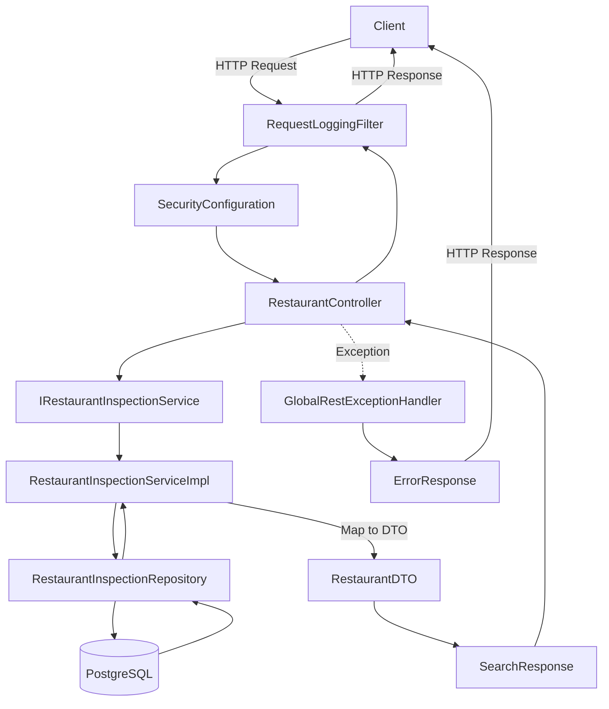

# API Package Structure Overview

Complete overview of all packages and their contents in the NYC Restaurants API.

```
api/src/main/java/com/example/api/
│
├── ApiApplication.java                    # Main Spring Boot application entry point
│
├── config/                                # Configuration classes
│   ├── ApplicationConfiguration.java      # General app config (ObjectMapper bean)
│   └── SecurityConfiguration.java         # Security & CORS configuration
│
├── controller/                            # REST API endpoints
│   └── RestaurantController.java          # Restaurant query endpoints
│       ├── POST /api/restaurants/query
│       ├── POST /api/restaurants/details
│       ├── GET  /api/restaurants/boroughs
│       ├── GET  /api/restaurants/cuisines
│       └── GET  /api/restaurants/health
│
├── dtos/                                  # Data Transfer Objects
│   ├── SearchRequest.java                 # Request DTO for restaurant search
│   ├── RestaurantDetailsRequest.java      # Request DTO for restaurant details
│   └── RestaurantDTO.java                 # Response DTO for restaurant data
│
├── entities/                              # JPA entities
│   └── RestaurantInspection.java          # Database table mapping
│       └── RestaurantInspectionId.java    # Composite primary key class
│
├── exceptions/                            # Custom exceptions (if needed)
│   └── GlobalExceptionHandler.java        # Legacy exception handler
│
├── implementations/                       # Service implementations
│   └── RestaurantInspectionServiceImpl.java  # Business logic implementation
│
├── model/                                 # Domain models and enums
│   ├── Borough.java                       # NYC borough enum
│   ├── Grade.java                         # Health inspection grade enum
│   ├── InspectionType.java                # Inspection type enum
│   └── CriticalFlag.java                  # Violation criticality enum
│
├── repository/                            # Data access layer
│   └── RestaurantInspectionRepository.java  # JPA repository with custom queries
│
├── responses/                             # Response wrapper objects
│   ├── SearchResponse.java                # Wrapper for search results
│   └── RestaurantDetailsResponse.java     # Wrapper for restaurant details
│
├── service/                               # Service interfaces
│   ├── IRestaurantInspectionService.java  # Service interface
│   └── RestaurantInspectionService.java   # (Legacy, can be removed)
│
├── util/                                  # Utility classes
│   └── JsonUtils.java                     # JSON serialization utilities
│
└── web/                                   # Web layer components
    ├── ApiKeyAuthenticationFilter.java    # API key authentication filter (@Order(1))
    ├── ErrorResponse.java                 # Standardized error response DTO
    ├── GlobalRestExceptionHandler.java    # Global exception handler
    ├── RequestLoggingFilter.java          # Request/response logging filter
    └── WebConfiguration.java              # Web MVC configuration
```

## Package Descriptions

### 📦 config/
Application-wide configuration classes for beans, security, and settings.

### 🎮 controller/
REST controllers that handle HTTP requests and return responses.

### 📄 dtos/
Data Transfer Objects used for API request/response payloads.

### 🗄️ entities/
JPA entities that map to database tables.

### ⚠️ exceptions/
Custom exception classes (legacy folder, functionality moved to web/).

### 🔧 implementations/
Concrete implementations of service interfaces containing business logic.

### 📊 model/
Domain models, enums, and constants representing business concepts.

### 💾 repository/
Data access layer using Spring Data JPA repositories.

### 📤 responses/
Response wrapper classes that structure API responses.

### 🔬 service/
Service layer interfaces defining business operations.

### 🛠️ util/
Utility classes and helper functions.

### 🌐 web/
Web layer components: filters, exception handlers, and configurations.
- **ApiKeyAuthenticationFilter**: Optional API key authentication for securing endpoints
- **ErrorResponse**: Standardized error response structure
- **GlobalRestExceptionHandler**: Centralized exception handling
- **RequestLoggingFilter**: Request/response audit logging
- **WebConfiguration**: Spring MVC configuration

## Key Design Patterns

### 1. Interface-Implementation Pattern
```
service/IRestaurantInspectionService.java (interface)
    ↓ implemented by
implementations/RestaurantInspectionServiceImpl.java
    ↓ injected into
controller/RestaurantController.java
```

### 2. DTO Pattern
```
Entity (RestaurantInspection)
    ↓ mapped to
DTO (RestaurantDTO)
    ↓ wrapped in
Response (SearchResponse)
    ↓ returned to client
```

### 3. Repository Pattern
```
repository/RestaurantInspectionRepository.java
    ↓ extends JpaRepository
    ↓ injected into
implementations/RestaurantInspectionServiceImpl.java
```

### 4. Global Exception Handling
```
Any Controller Exception
    ↓ caught by
web/GlobalRestExceptionHandler.java
    ↓ converted to
web/ErrorResponse.java
    ↓ returned to client
```

## Request Flow

```
1. Client sends HTTP request
        ↓
2. ApiKeyAuthenticationFilter validates API key (if enabled, @Order(1))
        ↓
3. RequestLoggingFilter logs request
        ↓
4. Spring Security (CORS check)
        ↓
5. RestaurantController receives request
        ↓
5. Validates with @Valid annotation
        ↓
6. Calls IRestaurantInspectionService
        ↓
7. RestaurantInspectionServiceImpl executes business logic
        ↓
8. RestaurantInspectionRepository queries database
        ↓
9. Hibernate/JPA executes SQL
        ↓
10. PostgreSQL returns data
        ↓
11. Service maps Entity → DTO
        ↓
12. Controller wraps in Response object
        ↓
13. Jackson serializes to JSON
        ↓
14. RequestLoggingFilter logs response
        ↓
15. Client receives HTTP response
```

## Database to API Flow

```
PostgreSQL Table: nyc_restaurant_inspections
    ↓ mapped by
JPA Entity: RestaurantInspection
    ↓ queried by
Repository: RestaurantInspectionRepository
    ↓ called by
Service: RestaurantInspectionServiceImpl
    ↓ mapped to
DTO: RestaurantDTO
    ↓ wrapped in
Response: SearchResponse
    ↓ serialized by
Jackson ObjectMapper (JsonUtils)
    ↓ returned as
JSON to client
```

## Component Interactions



## File Count Summary

- Config: 2 files
- Controllers: 1 file
- DTOs: 3 files
- Entities: 1 file
- Exceptions: 1 file
- Implementations: 1 file
- Models: 4 files
- Repositories: 1 file
- Responses: 2 files
- Services: 2 files
- Utils: 1 file
- Web: 5 files

**Total: 24 Java files**

## Technologies Used

- **Spring Boot 3.5.6**: Application framework
- **Spring Data JPA**: Data access
- **Spring Security**: CORS and authentication
- **Hibernate**: ORM
- **PostgreSQL**: Database
- **Lombok**: Boilerplate reduction
- **Jackson**: JSON processing
- **Jakarta Validation**: Request validation
- **SLF4J**: Logging

## Best Practices Implemented

✅ Clear separation of concerns
✅ Interface-based design
✅ DTO pattern for data transfer
✅ Global exception handling
✅ Request/response logging
✅ CORS configuration
✅ Input validation
✅ Comprehensive documentation
✅ Type-safe enums
✅ Transactional support
