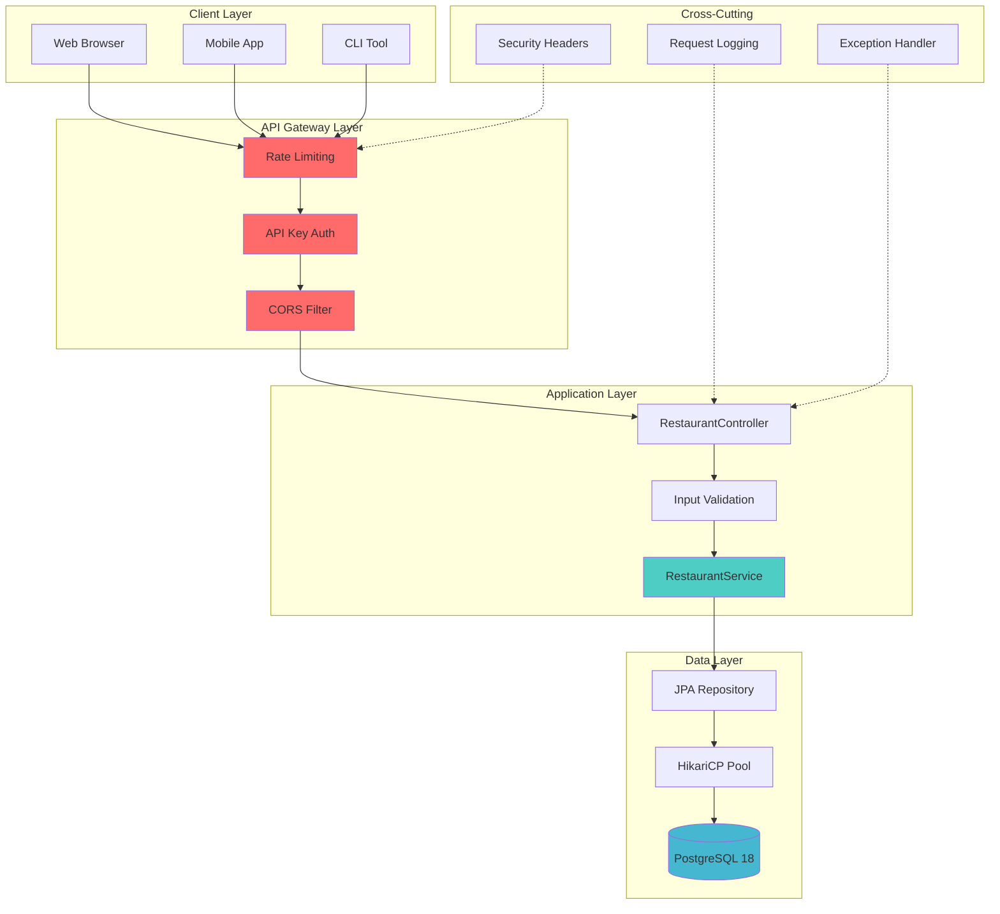
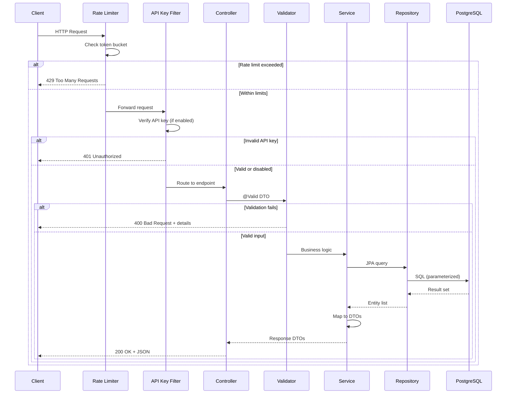

# 🍕 NYC Restaurants API

[](https://spring.io/projects/spring-boot)
[](https://www.oracle.com/java/technologies/downloads/)
[](https://www.postgresql.org/)
[](../../LICENSE)
[](SECURITY.md)

> A production-grade Spring Boot REST API providing secure, performant access to 200,000+ NYC restaurant health inspection records. Built with enterprise security patterns, comprehensive validation, and optimized for cloud deployment.

---

## 📑 Table of Contents

- [Overview](#-overview)
- [Feature Highlights](#-feature-highlights)
- [Architecture & Design](#-architecture--design)
- [Getting Started](#-getting-started)
- [API Reference](#-api-reference)
- [Security Features](#-security-features)
- [Development Guide](#-development-guide)
- [Testing & Quality](#-testing--quality)
- [Configuration](#-configuration)
- [Troubleshooting](#-troubleshooting)
- [Contributing](#-contributing)
- [License & Credits](#-license--credits)

[⬆ Back to top](#-nyc-restaurants-api)

---

## 🎯 Overview

The **NYC Restaurants API** is a comprehensive backend service that exposes NYC Department of Health restaurant inspection data through a secure, scalable REST API. This project demonstrates professional Spring Boot development practices and serves as both a functional application and an educational resource for cloud-native API development.

### What Problem Does This Solve?

- **Data Accessibility**: Transforms 200,000+ public health inspection records into an easily queryable API
- **Security First**: Implements production-ready security patterns (rate limiting, input validation, CORS, API keys)
- **Cloud Ready**: Containerized, stateless design optimized for cloud deployment
- **Developer Friendly**: Comprehensive documentation, testing utilities, and clear code organization

### Target Audience

- 🎓 **Students**: Learn enterprise Spring Boot patterns and cloud architecture
- 🔧 **Developers**: Reference implementation for secure REST APIs
- 🏢 **Enterprises**: Foundation for food safety applications
- 🌐 **NYC Residents**: Access restaurant health data programmatically

[⬆ Back to top](#-nyc-restaurants-api)

---

## ✨ Feature Highlights

### 🔍 Core Capabilities

- ✅ **Advanced Search** - Filter by borough, cuisine, grade with pagination
- ✅ **Restaurant Details** - Complete inspection history and violation records
- ✅ **Reference Data** - Enumerate boroughs, cuisines, grades, inspection types
- ✅ **Health Checks** - Kubernetes/Docker-ready liveness and readiness probes

### 🛡️ Enterprise Security

- ✅ **Input Validation** - Bean Validation (JSR-380) with custom sanitizers
- ✅ **Rate Limiting** - Token bucket algorithm (100 req/min per IP)
- ✅ **SQL Injection Prevention** - Parameterized queries with JPA
- ✅ **XSS Protection** - Input sanitization and Content Security Policy
- ✅ **Security Headers** - X-Frame-Options, CSP, HSTS-ready
- ✅ **CORS Configuration** - Environment-specific origin policies
- ✅ **API Key Authentication** - Optional token-based access control
- ✅ **Audit Logging** - Request/response logging with timing metrics

### 🚀 Performance & Scalability

- ✅ **Optimized Queries** - Indexed database queries with pagination
- ✅ **Stateless Design** - Horizontal scaling ready
- ✅ **Connection Pooling** - HikariCP for efficient database connections
- ✅ **Lazy Loading** - JPA optimization for large datasets
- ✅ **Docker Support** - Multi-stage builds, health checks

### 📊 Developer Experience

- ✅ **Comprehensive Docs** - OpenAPI-ready with detailed examples
- ✅ **Testing Utilities** - Automated API test scripts
- ✅ **Error Handling** - Consistent error responses with validation details
- ✅ **Request Logging** - Detailed audit trail for debugging

> 💡 **Pro Tip**: Start with the [Quick Start](#-getting-started) to get running in 5 minutes, then explore [Security Features](SECURITY.md) for production deployment.

[⬆ Back to top](#-nyc-restaurants-api)

---

## 🏗️ Architecture & Design

### High-Level Architecture



### Request Flow Sequence



### Component Responsibilities

| Component | Responsibility | Key Technologies |
|-----------|---------------|------------------|
| **Controller Layer** | HTTP request handling, routing | Spring MVC, REST |
| **Service Layer** | Business logic, DTO mapping | Spring @Service, @Transactional |
| **Repository Layer** | Data access, queries | Spring Data JPA, JPQL |
| **Security Filters** | Authentication, rate limiting | Servlet Filters, Bucket4j |
| **Validation Layer** | Input sanitization, Bean Validation | Jakarta Validation, Regex |
| **Exception Handlers** | Global error handling | @RestControllerAdvice |

### Technology Stack

#### Backend Framework
- **Spring Boot 3.5.6** - Application framework with embedded Tomcat
- **Spring Data JPA** - Repository abstraction over Hibernate
- **Spring Security** - CORS and authentication infrastructure
- **Hibernate 6.x** - ORM with lazy loading and caching

#### Database & Persistence
- **PostgreSQL 18** - Production-grade relational database
- **HikariCP** - High-performance JDBC connection pool
- **Flyway** - Database migration management (optional)

#### Security & Validation
- **Bucket4j** - Token bucket rate limiting
- **Jakarta Validation** - Bean Validation API (JSR-380)
- **OWASP Java Encoder** - XSS prevention utilities

#### Build & Development
- **Gradle 8.x** - Build automation with Kotlin DSL
- **Lombok** - Boilerplate code reduction
- **SLF4J + Logback** - Structured logging

#### Testing
- **JUnit 5** - Unit testing framework
- **Mockito** - Mocking framework
- **Spring Boot Test** - Integration testing utilities

> ⚠️ **Architecture Note**: This API follows a layered architecture with clear separation of concerns. For detailed package structure, see [PACKAGE_STRUCTURE.md](PACKAGE_STRUCTURE.md).

[⬆ Back to top](#-nyc-restaurants-api)

---

## 🚀 Getting Started

### Prerequisites

Ensure you have the following installed:

| Tool | Version | Purpose |
|------|---------|---------|
| **Java JDK** | 21+ | Runtime environment |
| **Docker** | 20.10+ | PostgreSQL container |
| **Docker Compose** | V2+ | Multi-container orchestration |
| **Gradle** | 8.x (wrapper included) | Build automation |
| **curl** | Any | API testing (optional) |

### Installation Steps

#### 1️⃣ Clone the Repository

```bash
git clone https://github.com/GDSC-FSC/gdg-fsc-x-bc-cloud-workshop.git
cd gdg-fsc-x-bc-cloud-workshop
```

#### 2️⃣ Set Up Database

**Option A: Using npm scripts (Recommended)**
```bash
npm run db:setup  # Creates Docker network, volume, and PostgreSQL container
npm run db:seed   # Loads 200,000+ NYC restaurant records
```

**Option B: Using bash scripts**
```bash
./scripts/db-setup.sh
./scripts/db-seed.sh
```

**Option C: Manual Docker**
```bash
docker network create pgnetwork
docker volume create pgdata
docker run --name postgres --network pgnetwork \
  -e POSTGRES_PASSWORD=brooklyn \
  -v pgdata:/var/lib/postgresql/data \
  -p 5432:5432 -d postgres:18
```

<details>
<summary>📊 <strong>View database setup details</strong></summary>

The database setup creates:
- **Network**: `pgnetwork` (user-defined bridge)
- **Volume**: `pgdata` (persistent storage)
- **Container**: `postgres` (PostgreSQL 18)
- **Table**: `nyc_restaurant_inspections` (~200K rows)
- **Indexes**: Composite index on `(camis, inspection_date)`

Verify setup:
```bash
docker exec postgres psql -U postgres -c "SELECT COUNT(*) FROM nyc_restaurant_inspections;"
```
</details>

#### 3️⃣ Build the API

```bash
cd api
./gradlew clean build
```

**Build output:**
```
BUILD SUCCESSFUL in 15s
7 actionable tasks: 7 executed
```

#### 4️⃣ Run the API

**Option A: Using Gradle**
```bash
./gradlew bootRun
```

**Option B: Using JAR**
```bash
java -jar build/libs/api-0.0.1-SNAPSHOT.jar
```

**Option C: Using npm**
```bash
npm run api:dev  # From project root
```

**Expected console output:**
```
  .   ____          _            __ _ _
 /\\ / ___'_ __ _ _(_)_ __  __ _ \ \ \ \
( ( )\___ | '_ | '_| | '_ \/ _` | \ \ \ \
 \\/  ___)| |_)| | | | | || (_| |  ) ) ) )
  '  |____| .__|_| |_|_| |_\__, | / / / /
 =========|_|==============|___/=/_/_/_/
 :: Spring Boot ::               (v3.5.6)

2025-10-09 10:30:00 INFO  - Starting ApiApplication on localhost
2025-10-09 10:30:02 INFO  - Started ApiApplication in 2.5 seconds
```

#### 5️⃣ Verify Installation

```bash
# Health check
curl http://localhost:8080/api/restaurants/health

# Expected response:
# {"status":"UP","timestamp":"2025-10-09T10:30:00Z"}
```

### Quick Test

Run the comprehensive test suite:

```bash
# From project root
./scripts/test-api.sh

# Or with npm
npm run test:api
```

> ✅ **Success Indicator**: You should see successful responses for health check, borough list, cuisine list, and search queries.

[⬆ Back to top](#-nyc-restaurants-api)

---

## 📡 API Reference

### Base URL

```
http://localhost:8080/api/restaurants
```

### Endpoints Overview

| Method | Endpoint | Purpose | Auth Required |
|--------|----------|---------|---------------|
| `GET` | `/health` | Health check | No |
| `POST` | `/query` | Search restaurants | Optional* |
| `POST` | `/details` | Restaurant details | Optional* |
| `GET` | `/boroughs` | List all boroughs | Optional* |
| `GET` | `/cuisines` | List all cuisines | Optional* |

*API key required only if `security.api-key.enabled=true`

---

### 🏥 Health Check

**Endpoint:** `GET /api/restaurants/health`

**Purpose:** Kubernetes/Docker liveness probe

**Response:**
```json
{
  "status": "UP",
  "timestamp": "2025-10-09T10:30:00Z"
}
```

**Example:**
```bash
curl http://localhost:8080/api/restaurants/health
```

---

### 🔍 Search Restaurants

**Endpoint:** `POST /api/restaurants/query`

**Purpose:** Search restaurants with flexible filtering

**Request Body:**
```json
{
  "borough": "MANHATTAN",      // Optional: MANHATTAN, BROOKLYN, QUEENS, BRONX, STATEN_ISLAND
  "cuisine": "Pizza",           // Optional: partial match (case-insensitive)
  "minGrade": "A",             // Optional: A, B, C, P, Z, NOT_YET_GRADED
  "limit": 100                 // Optional: 1-1000 (default: 100)
}
```

**Validation Rules:**
- `borough`: Must be valid NYC borough enum
- `cuisine`: Max 100 characters, alphanumeric + spaces
- `minGrade`: Single uppercase letter or valid grade constant
- `limit`: Between 1 and 1000

**Response:**
```json
{
  "count": 10,
  "results": [
    {
      "camis": "50012345",
      "dba": "Joe's Pizza",
      "boro": "MANHATTAN",
      "building": "123",
      "street": "BROADWAY",
      "zipcode": "10012",
      "phone": "2125551234",
      "cuisine_description": "Pizza",
      "inspection_date": "2024-03-15",
      "action": "Violations were cited in the following area(s).",
      "violation_code": "10F",
      "violation_description": "Non-food contact surface improperly constructed...",
      "critical_flag": "NOT_CRITICAL",
      "score": 12,
      "grade": "A",
      "grade_date": "2024-03-15",
      "record_date": "2024-03-20",
      "inspection_type": "CYCLE",
      "latitude": 40.7282,
      "longitude": -73.9942
    }
  ]
}
```

**Example:**
```bash
curl -X POST http://localhost:8080/api/restaurants/query \
  -H "Content-Type: application/json" \
  -d '{
    "borough": "MANHATTAN",
    "cuisine": "Pizza",
    "minGrade": "A",
    "limit": 10
  }'
```

**Error Responses:**
```json
// 400 Bad Request - Validation error
{
  "timestamp": "2025-10-09T10:30:00",
  "status": 400,
  "error": "Bad Request",
  "message": "Validation failed",
  "path": "/api/restaurants/query",
  "validationErrors": [
    {
      "field": "limit",
      "message": "must be less than or equal to 1000"
    }
  ]
}

// 429 Too Many Requests - Rate limit
{
  "error": "Rate limit exceeded",
  "message": "Too many requests from your IP address",
  "retryAfter": 60
}
```

---

### 📋 Get Restaurant Details

**Endpoint:** `POST /api/restaurants/details`

**Purpose:** Retrieve complete inspection history for a specific restaurant

**Request Body:**
```json
{
  "restaurantName": "Joe's Pizza",  // Required: full or partial name
  "borough": "MANHATTAN"             // Optional: narrows search
}
```

**Response:**
```json
{
  "restaurantName": "JOE'S PIZZA",
  "borough": "MANHATTAN",
  "inspections": [
    {
      "camis": "50012345",
      "dba": "Joe's Pizza",
      // ... full inspection details
    }
  ],
  "totalInspections": 15
}
```

**Example:**
```bash
curl -X POST http://localhost:8080/api/restaurants/details \
  -H "Content-Type: application/json" \
  -H "X-API-Key: your-key-if-enabled" \
  -d '{
    "restaurantName": "Joe",
    "borough": "BROOKLYN"
  }'
```

---

### 🗺️ Get All Boroughs

**Endpoint:** `GET /api/restaurants/boroughs`

**Purpose:** List all NYC boroughs in the dataset

**Response:**
```json
{
  "boroughs": [
    "MANHATTAN",
    "BROOKLYN",
    "QUEENS",
    "BRONX",
    "STATEN_ISLAND"
  ]
}
```

**Example:**
```bash
curl http://localhost:8080/api/restaurants/boroughs
```

---

### 🍽️ Get All Cuisines

**Endpoint:** `GET /api/restaurants/cuisines`

**Purpose:** List all cuisine types in the dataset

**Response:**
```json
{
  "cuisines": [
    "Pizza",
    "Chinese",
    "Italian",
    "Mexican",
    "American",
    // ... 80+ cuisines
  ]
}
```

**Example:**
```bash
curl http://localhost:8080/api/restaurants/cuisines
```

<details>
<summary>🔐 <strong>Using API Key Authentication</strong></summary>

If API key authentication is enabled, include the key in request headers:

```bash
curl -X POST http://localhost:8080/api/restaurants/query \
  -H "Content-Type: application/json" \
  -H "X-API-Key: your-secret-key" \
  -d '{"borough": "MANHATTAN", "limit": 5}'
```

Enable in `application.properties`:
```properties
security.api-key.enabled=true
security.api-key.keys=key1,key2,key3
```
</details>

[⬆ Back to top](#-nyc-restaurants-api)

---

## 🛡️ Security Features

The API implements multiple layers of security following OWASP best practices.

### Security Layers

```mermaid
graph LR
    A[Client Request] --> B[Rate Limiting<br/>100 req/min]
    B --> C[API Key Check<br/>Optional]
    C --> D[CORS Validation<br/>Origin check]
    D --> E[Input Validation<br/>Bean Validation]
    E --> F[Input Sanitization<br/>XSS/SQL prevention]
    F --> G[Security Headers<br/>CSP, X-Frame]
    G --> H[Business Logic]
    H --> I[Parameterized Queries<br/>JPA]
    I --> J[Response]
    
    style B fill:#ff6b6b
    style C fill:#ff6b6b
    style E fill:#ff6b6b
    style F fill:#ff6b6b
    style I fill:#4ecdc4
```



### Key Security Features

| Feature | Implementation | Configuration |
|---------|---------------|---------------|
| **Rate Limiting** | Token bucket (Bucket4j) | 100 req/min per IP |
| **Input Validation** | Jakarta Validation | `@Valid` on DTOs |
| **SQL Injection** | JPA parameterized queries | Automatic |
| **XSS Protection** | Input sanitization + CSP | Custom validators |
| **CORS** | Spring Security config | Environment-specific |
| **API Keys** | Servlet filter | Optional, configurable |
| **Security Headers** | Custom filter | X-Frame, CSP, etc. |
| **Audit Logging** | Request/response filter | All requests logged |

> 📚 **Deep Dive**: For comprehensive security documentation, see [SECURITY.md](SECURITY.md) and [SECURITY_QUICK_REFERENCE.md](SECURITY_QUICK_REFERENCE.md).

[⬆ Back to top](#-nyc-restaurants-api)

---

## 💻 Development Guide

### Project Structure

```
api/src/main/java/com/example/api/
├── 📱 ApiApplication.java              # Spring Boot entry point
├── ⚙️ config/                          # Configuration beans
│   ├── ApplicationConfiguration.java   # ObjectMapper, general config
│   ├── RateLimitingConfiguration.java  # Bucket4j rate limits
│   └── SecurityConfiguration.java      # CORS, Spring Security
├── 🎮 controller/                      # REST endpoints
│   └── RestaurantController.java       # All API endpoints
├── 📦 dtos/                            # Data Transfer Objects
│   ├── SearchRequest.java              # Query parameters
│   ├── RestaurantDetailsRequest.java   # Details request
│   └── RestaurantDTO.java              # Restaurant response
├── 🗄️ entities/                        # JPA entities
│   └── RestaurantInspection.java       # Database table mapping
├── 🔧 implementations/                 # Service implementations
│   └── RestaurantInspectionServiceImpl.java
├── 📊 model/                           # Domain models & enums
│   ├── Borough.java                    # NYC boroughs enum
│   ├── Grade.java                      # Health grades enum
│   ├── InspectionType.java             # Inspection types enum
│   └── CriticalFlag.java               # Violation criticality
├── 💾 repository/                      # Data access layer
│   └── RestaurantInspectionRepository.java
├── 📤 responses/                       # Response wrappers
│   ├── SearchResponse.java
│   └── RestaurantDetailsResponse.java
├── 🔬 service/                         # Business logic interfaces
│   └── IRestaurantInspectionService.java
├── 🛠️ util/                            # Utilities
│   └── InputSanitizer.java             # Input validation
└── 🌐 web/                             # Web layer
    ├── ErrorResponse.java              # Error DTOs
    ├── GlobalRestExceptionHandler.java # Exception handling
    ├── RequestLoggingFilter.java       # Audit logging
    └── WebConfiguration.java           # MVC config
```

### Development Workflow

#### 1️⃣ Local Development Setup

```bash
# Start database
npm run db:setup
npm run db:seed

# Run API in dev mode
cd api
./gradlew bootRun --args='--spring.profiles.active=dev'
```

#### 2️⃣ Make Code Changes

The API uses Spring DevTools for hot reload. Changes to Java files will automatically restart the application.

#### 3️⃣ Run Tests

```bash
# Unit tests
./gradlew test

# Integration tests
./gradlew integrationTest

# All tests
./gradlew check
```

#### 4️⃣ Format Code

```bash
# From project root
npm run format

# Or directly
cd api
./gradlew spotlessApply
```

#### 5️⃣ Build Production JAR

```bash
./gradlew clean build
```

### Adding New Endpoints

```java
// 1. Create DTO (dtos/MyRequest.java)
@Data
public class MyRequest {
    @NotBlank
    @Size(max = 100)
    private String searchTerm;
}

// 2. Add service method (service/IRestaurantInspectionService.java)
List<RestaurantDTO> customSearch(String term);

// 3. Implement service (implementations/RestaurantInspectionServiceImpl.java)
@Override
public List<RestaurantDTO> customSearch(String term) {
    return repository.findByCustomCriteria(term)
        .stream()
        .map(this::mapToDTO)
        .collect(Collectors.toList());
}

// 4. Create controller endpoint (controller/RestaurantController.java)
@PostMapping("/custom-search")
public ResponseEntity<SearchResponse> customSearch(@Valid @RequestBody MyRequest request) {
    List<RestaurantDTO> results = service.customSearch(request.getSearchTerm());
    return ResponseEntity.ok(new SearchResponse(results.size(), results));
}
```

[⬆ Back to top](#-nyc-restaurants-api)

---

## 🧪 Testing & Quality

### Automated Testing

#### Run All Tests

```bash
# From project root
npm run test:api

# Or directly
cd api
./gradlew test
```

#### Test Individual Endpoints

```bash
# Health check
curl http://localhost:8080/api/restaurants/health

# Search with filters
curl -X POST http://localhost:8080/api/restaurants/query \
  -H "Content-Type: application/json" \
  -d '{
    "borough": "MANHATTAN",
    "cuisine": "Pizza",
    "minGrade": "A",
    "limit": 5
  }'

# Get reference data
curl http://localhost:8080/api/restaurants/boroughs
curl http://localhost:8080/api/restaurants/cuisines
```

### Security Testing

Test security features manually:

<details>
<summary>🔍 <strong>SQL Injection Test</strong></summary>

```bash
# Should return 400 Bad Request
curl -X POST http://localhost:8080/api/restaurants/query \
  -H "Content-Type: application/json" \
  -d '{"borough": "MANHATTAN; DROP TABLE restaurants;"}'
```
</details>

<details>
<summary>🔍 <strong>XSS Prevention Test</strong></summary>

```bash
# Should return 400 Bad Request
curl -X POST http://localhost:8080/api/restaurants/details \
  -H "Content-Type: application/json" \
  -d '{"restaurantName": "<script>alert(\"XSS\")</script>"}'
```
</details>

<details>
<summary>🔍 <strong>Rate Limiting Test</strong></summary>

```bash
# Send 150 requests rapidly (should get 429 after ~100)
for i in {1..150}; do
  curl -w "%{http_code}\n" -o /dev/null -s \
    http://localhost:8080/api/restaurants/health
done
```
</details>

### Load Testing

Use Apache Bench or similar tools:

```bash
# 1000 requests, 10 concurrent
ab -n 1000 -c 10 -p query.json -T application/json \
  http://localhost:8080/api/restaurants/query
```

Where `query.json`:
```json
{"borough": "MANHATTAN", "limit": 10}
```

[⬆ Back to top](#-nyc-restaurants-api)

## ⚙️ Configuration

### Environment-Specific Configuration

The API uses Spring profiles for environment-specific settings:

```bash
# Development
./gradlew bootRun --args='--spring.profiles.active=dev'

# Production
java -jar api.jar --spring.profiles.active=prod
```

### Application Properties

**File:** `src/main/resources/application.properties`

```properties
# Application
spring.application.name=nyc-restaurants-api
server.port=8080
server.shutdown=graceful

# Database
spring.datasource.url=jdbc:postgresql://localhost:5432/postgres
spring.datasource.username=postgres
spring.datasource.password=brooklyn
spring.datasource.driver-class-name=org.postgresql.Driver

# JPA/Hibernate
spring.jpa.hibernate.ddl-auto=validate
spring.jpa.show-sql=false
spring.jpa.properties.hibernate.format_sql=true
spring.jpa.properties.hibernate.jdbc.batch_size=20

# Connection Pool (HikariCP)
spring.datasource.hikari.maximum-pool-size=10
spring.datasource.hikari.minimum-idle=5
spring.datasource.hikari.connection-timeout=30000

# Security
security.api-key.enabled=false
security.api-key.keys=

# Logging
logging.level.root=INFO
logging.level.com.example.api=DEBUG
logging.file.name=/tmp/spring-boot-api.log
```

### Environment Variables

For production, use environment variables instead of hardcoded values:

```bash
export DB_URL=jdbc:postgresql://prod-db:5432/restaurants
export DB_USERNAME=api_user
export DB_PASSWORD=strong_password_here
export API_KEYS=key1,key2,key3
export SECURITY_ENABLED=true
```

**Updated application.properties:**
```properties
spring.datasource.url=${DB_URL}
spring.datasource.username=${DB_USERNAME}
spring.datasource.password=${DB_PASSWORD}
security.api-key.enabled=${SECURITY_ENABLED}
security.api-key.keys=${API_KEYS}
```

### Docker Configuration

The API includes a Dockerfile for containerization:

```bash
# Build image
docker build -t gdg-api:latest api/

# Run container
docker run -d -p 8080:8080 \
  -e DB_URL=jdbc:postgresql://postgres:5432/postgres \
  -e DB_USERNAME=postgres \
  -e DB_PASSWORD=brooklyn \
  --name api \
  --network pgnetwork \
  gdg-api:latest
```

[⬆ Back to top](#-nyc-restaurants-api)

---

## 🚨 Troubleshooting

### Common Issues

#### 🔴 Database Connection Refused

**Symptoms:** `java.net.ConnectException: Connection refused`

**Solutions:**
```bash
# 1. Check if PostgreSQL is running
docker ps | grep postgres

# 2. Restart PostgreSQL
docker restart postgres

# 3. Verify network connectivity
docker network inspect pgnetwork

# 4. Test connection manually
psql -h localhost -p 5432 -U postgres -d postgres
```

#### 🔴 Port 8080 Already in Use

**Symptoms:** `Port 8080 is already in use`

**Solutions:**
```bash
# Option 1: Kill existing process
lsof -ti:8080 | xargs kill -9

# Option 2: Use different port
echo "server.port=8081" >> application.properties
```

#### 🔴 Out of Memory Error

**Symptoms:** `java.lang.OutOfMemoryError: Java heap space`

**Solutions:**
```bash
# Increase heap size
export JAVA_OPTS="-Xms512m -Xmx2048m"
java $JAVA_OPTS -jar api.jar

# Or with Gradle
./gradlew bootRun -Dorg.gradle.jvmargs="-Xmx2048m"
```

#### 🔴 Slow Query Performance

**Symptoms:** Queries taking >1 second

**Solutions:**
```sql
-- Check if indexes exist
SELECT * FROM pg_indexes WHERE tablename = 'nyc_restaurant_inspections';

-- Add missing indexes
CREATE INDEX IF NOT EXISTS idx_camis_inspection 
  ON nyc_restaurant_inspections(camis, inspection_date);

CREATE INDEX IF NOT EXISTS idx_borough 
  ON nyc_restaurant_inspections(boro);

-- Analyze table statistics
ANALYZE nyc_restaurant_inspections;
```

#### 🔴 Rate Limit Too Restrictive

**Symptoms:** Legitimate users getting 429 errors

**Solution:** Adjust rate limit in `RateLimitingFilter.java`:
```java
private static final int CAPACITY = 200;  // Increase from 100
private static final Duration REFILL_PERIOD = Duration.ofMinutes(1);
```

### Debug Mode

Enable verbose logging:

```properties
# application.properties
logging.level.com.example.api=DEBUG
logging.level.org.springframework.web=DEBUG
logging.level.org.hibernate.SQL=DEBUG
logging.level.org.hibernate.type.descriptor.sql.BasicBinder=TRACE
```

### Health Checks

Monitor application health:

```bash
# Basic health
curl http://localhost:8080/api/restaurants/health

# Database connectivity
curl http://localhost:8080/actuator/health/db

# JVM metrics
curl http://localhost:8080/actuator/metrics
```

[⬆ Back to top](#-nyc-restaurants-api)

---

## 🤝 Contributing

We welcome contributions! Please follow these guidelines:

### Getting Started

1. **Fork the repository**
2. **Create a feature branch**
   ```bash
   git checkout -b feature/amazing-feature
   ```
3. **Make your changes**
4. **Run tests**
   ```bash
   ./gradlew test
   ```
5. **Commit with clear messages**
   ```bash
   git commit -m "feat: add amazing feature"
   ```
6. **Push and create PR**
   ```bash
   git push origin feature/amazing-feature
   ```

### Code Standards

- **Java Style**: Follow Google Java Style Guide
- **Format**: Run `./gradlew spotlessApply` before committing
- **Tests**: Maintain >80% code coverage
- **Documentation**: Update docs for API changes
- **Security**: Never commit secrets or credentials

### Commit Message Format

```
<type>(<scope>): <subject>

<body>

<footer>
```

**Types:** `feat`, `fix`, `docs`, `style`, `refactor`, `test`, `chore`

**Example:**
```
feat(api): add cuisine filtering to search endpoint

- Add cuisineType parameter to SearchRequest DTO
- Update repository query to support cuisine filtering
- Add validation for cuisine parameter
- Update API documentation

Closes #42
```

### Pull Request Checklist

- [ ] Tests pass (`./gradlew test`)
- [ ] Code formatted (`./gradlew spotlessApply`)
- [ ] Documentation updated
- [ ] No security vulnerabilities introduced
- [ ] CHANGELOG.md updated (if applicable)
- [ ] Backward compatible (or breaking changes documented)

[⬆ Back to top](#-nyc-restaurants-api)

---

## 📚 Additional Documentation

### Comprehensive Guides

- **[Security Guide](SECURITY.md)** - Complete security features, testing, and hardening
- **[Security Quick Reference](SECURITY_QUICK_REFERENCE.md)** - Quick setup and common tasks
- **[Package Structure](PACKAGE_STRUCTURE.md)** - Detailed code organization and patterns
- **[Additional Components](ADDITIONAL_COMPONENTS.md)** - Enums, filters, and utilities

### External Resources

- [Spring Boot Documentation](https://docs.spring.io/spring-boot/docs/current/reference/html/)
- [Spring Data JPA Reference](https://docs.spring.io/spring-data/jpa/docs/current/reference/html/)
- [PostgreSQL Documentation](https://www.postgresql.org/docs/current/)
- [NYC Open Data API](https://data.cityofnewyork.us/resource/43nn-pn8j.geojson)

[⬆ Back to top](#-nyc-restaurants-api)

---

## 📄 License & Credits

### License

This project is licensed under the **MIT License** - see the [LICENSE](../../LICENSE) file for details.

```
MIT License

Copyright (c) 2025 GDSC-FSC

Permission is hereby granted, free of charge, to any person obtaining a copy
of this software and associated documentation files (the "Software"), to deal
in the Software without restriction...
```

### Credits

**Maintainers:**
- GDSC FSC Team - [GitHub](https://github.com/GDSC-FSC)

**Data Source:**
- NYC Department of Health and Mental Hygiene
- [NYC Open Data Portal](https://opendata.cityofnewyork.us/)

**Built With:**
- [Spring Boot](https://spring.io/projects/spring-boot) - Application framework
- [PostgreSQL](https://www.postgresql.org/) - Database
- [Bucket4j](https://github.com/bucket4j/bucket4j) - Rate limiting
- [Lombok](https://projectlombok.org/) - Boilerplate reduction
- [Gradle](https://gradle.org/) - Build automation

### Contact & Support

- **Issues:** [GitHub Issues](https://github.com/GDSC-FSC/gdg-fsc-x-bc-cloud-workshop/issues)
- **Discussions:** [GitHub Discussions](https://github.com/GDSC-FSC/gdg-fsc-x-bc-cloud-workshop/discussions)
- **Security:** security@gdsc-fsc.org

### Acknowledgments

Special thanks to:
- Brooklyn College Computer Science Department
- Google Developer Student Clubs
- NYC Open Data initiative
- All contributors and maintainers

[⬆ Back to top](#-nyc-restaurants-api)

---

<div align="center">

**Made with ❤️ by GDSC FSC**

[Documentation](../../docs/README.md) • [Quick Start](../../docs/QUICK_START.md) • [Contributing](#-contributing) • [License](#-license--credits)

</div>
